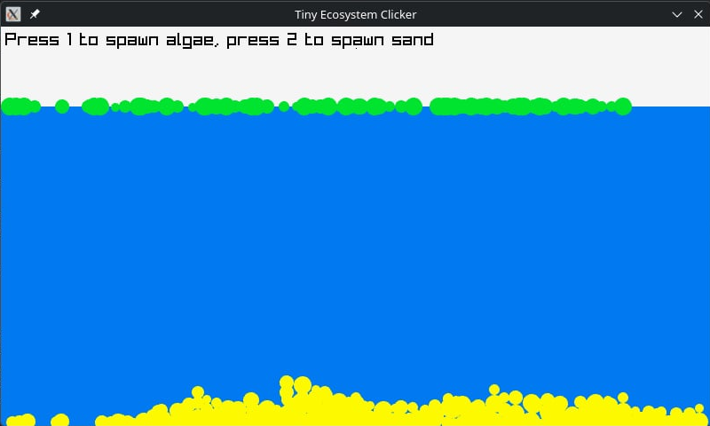

# Tiny Ecosystem Clicker

A small clicker+simulator game written in C++ using Raylib.

# Build

To compile this project, make sure you have the following dependencies installed:

- Raylib
- Git
- Make

Then clone this repository and build the project by running:

    make

## Screenshots

Algae and sand
 

 