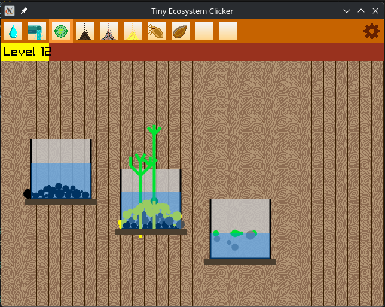

# Tiny Ecosystem Clicker

A small clicker+simulator game written in C++ using Raylib.

## Build

To compile this project, make sure you have the following dependencies installed:

- Raylib
- Git
- Make

Then clone this repository and build the project by running:

    make

## Features

- Algae - food source, floats in the water.
- Soil, gravel and sand - their particles fall to the bottom of the aquarium forming a substrate.
- Ostracod - moves in the water in search of food (algae). Can die from starvation.
- Seed - falls to the bottom of the aquarium or onto the substrate and grows into a simple plant.

## Graphical interface

At the top of the game window are action buttons. Each button represents an action that will be performed when you click the aquarium with the left mouse button.

Available actions:
1. Add water to the aquarium
2. Remove water from the aquarium
3. Throw algae into the aquarium
4. Throw soil
5. Throw gravel
6. Throw sand
7. Throw an ostracod
8. Throw a seed

Below the action buttons is an experience bar that shows your current level and the leveling progress.

## How to play

Steps:
1. Select an action using the buttons at the top of the game window.
2. Click the left mouse button anywhere in the aquarium area (everything below the experience bar). Each click performs the selected action.
3. You can switch actions at any time.

Final step: Enjoy your aquarium!

## Screenshots

 

 